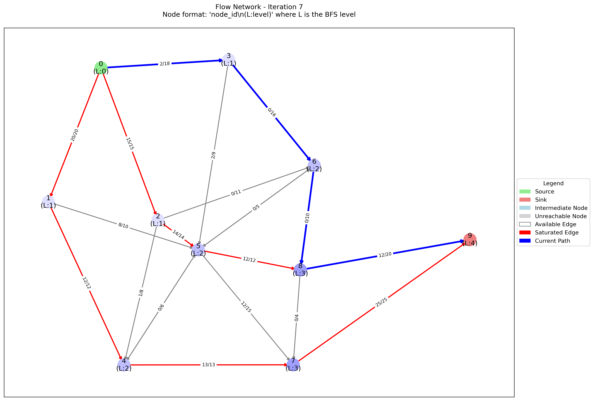

# Flow Network Visualization

A Python tool for visualizing Dinic's Maximum Flow Algorithm with step-by-step path finding and network flow states.

## Features

- Real-time visualization of augmenting paths
- BFS level graph visualization through node coloring
- Flow and capacity tracking
- Network saturation visualization

## Visual Elements

- **Nodes**
  - 🟢 Source node (green)
  - 🔴 Sink node (red)
  - 🔵 Intermediate nodes (colored by BFS level)
  - ⚪ Unreachable nodes (gray)

- **Edges**
  - Blue: Current augmenting path
  - Red: Saturated edges (flow = capacity)
  - Gray: Available edges (flow < capacity)

## Usage

```python
# Create graph
g = Graph(10)  # 10 nodes (0-9)

# Add edges: from_node, to_node, capacity
g.addEdge(0, 1, 20)
g.addEdge(1, 4, 12)
# ... add more edges

# Run algorithm
max_flow = g.DinicMaxflow(0, 9)
```

## Dependencies

```bash
pip install networkx matplotlib
```

## Output

- Generates PNG images in `dfs_paths/` directory
- Each image shows a found augmenting path
- Includes flow/capacity labels on edges
- Shows BFS levels for each node

## Examples


